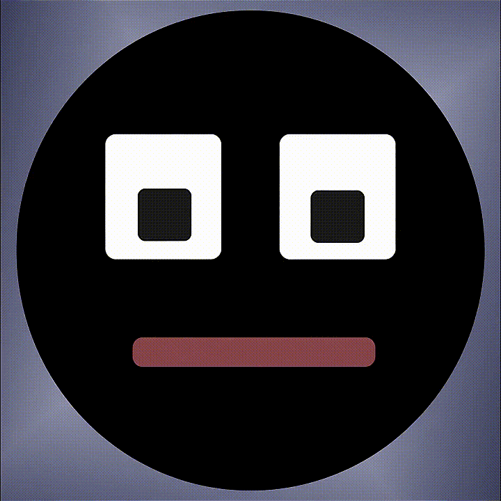
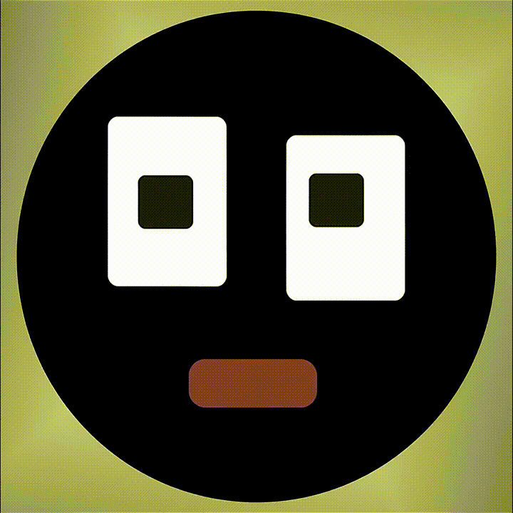
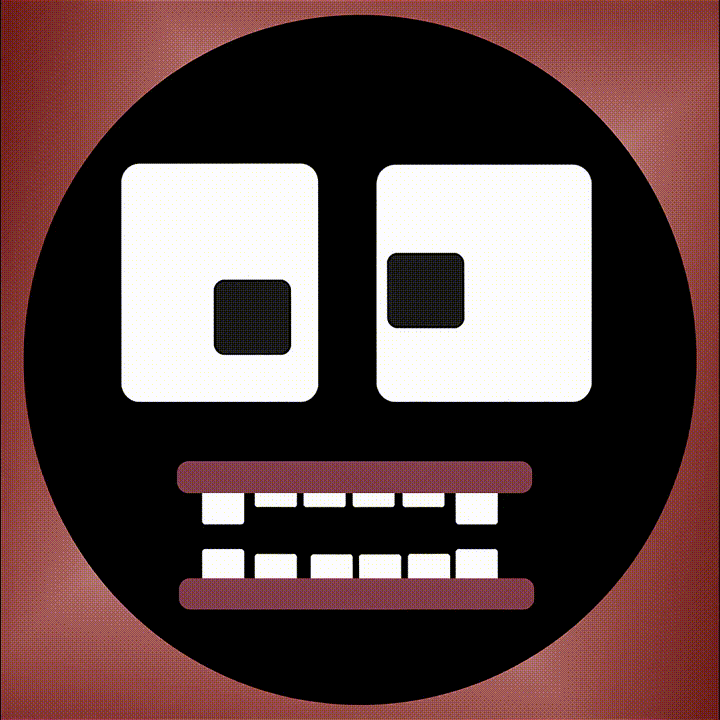
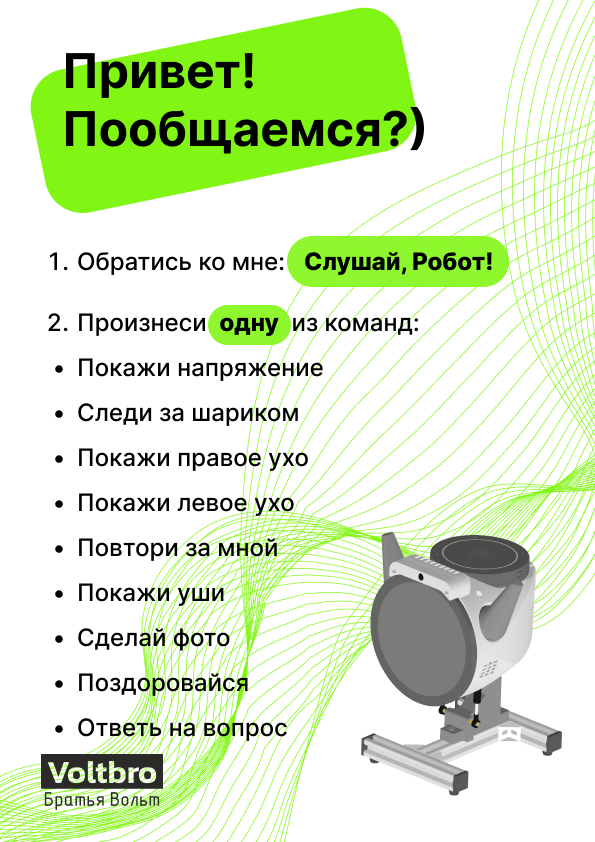
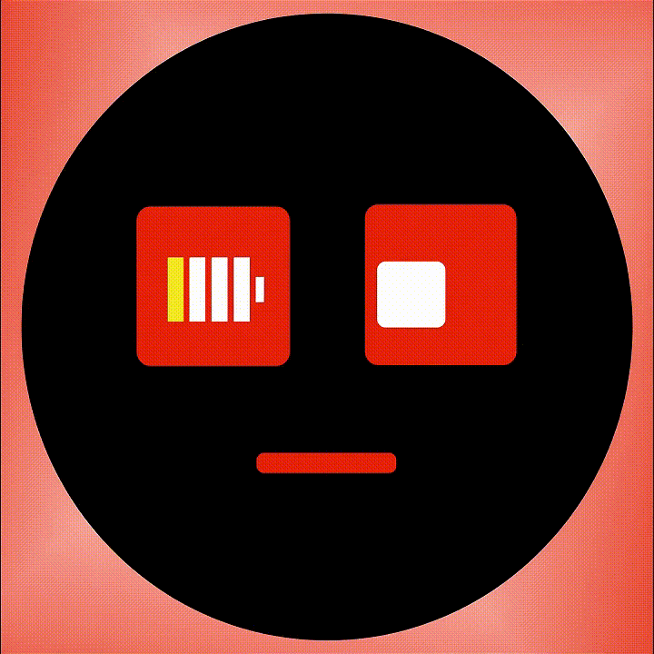

# Основые возможности

Роботизированная голова Bbrain готова к работе сразу после включения и поддерживает интерактивное управление голосом.
После включения Робоголова произносит "Ну привет!" и переходит в режим ожидания голосовой команды. На дисплее анимация:



## 🗣 Выполнение предустановленных (стандартных) голосовых команд

Для активации режима прослушивания голосовой команды **необходимо произнести ключевую фразу**:

> **Слушай, Робот!**

После активации Робоголова:

- поворачивается к говорящему;
- меняет выражение лица;
- ожидает дальнейшую команду.



:::note
Произносить голосовые команды необходимо после ключевой фразы
:::

```plain
Пример:
Слушай, Робот! Покажи левое ухо
```

**Таблица стандартных голосовых команд**

| Голосовая команда | Действие Робоголовы | Изображение на дисплее |
|-------------------|---------------------|------------------------|
| «Покажи левое ухо» | Движение левым ухом и озвучивание фразы: «Левое ухо» |  |
| «Покажи правое ухо» | Движение правым ухом и озвучивание фразы: «Правое» |  |
| «Покажи уши» | Одновременное движение обоими ушами и озвучивание фразы: «Ухи мои ухи» |  |
| «Поздоровайся» | Кивание и озвучивание фразы: «Ну привет» |  |
| «Сделай фото» | Показ изображения с камеры с обратным отсчётом | Изображение с камеры Робоголовы |
| «Следи за шариком» | Калибровка цвета (5 секунд) и слежение за цветным объектом (15 секунд) | Изображение с камеры Робоголовы с выделенным калибровочным контуром и распознанным шариком |
| "Повтори за мной" | Произносит "Я вас слушаю" -> Записывает то, что вы говорите -> Повторяет ваши слова своим голосом | <div style={{display: 'flex', gap: '10px', justifyContent: 'center'}}>   </div> |
| "Покажи напряжение" | Показывает текущее напряжение (В) и ток (А) на АКБ. Положительный ток = зарядка, отрицательный ток = разрядка | 
| "Ответь на вопрос" | Записывает ваш вопрос и отправляет большой языковой модели, чтобы получить ответ, далее ответ озвучивается. ВАЖНО: Требует дополнительной настройки! | <div style={{display: 'flex', gap: '10px', justifyContent: 'center'}}>    </div> |

:::tip[**Совет**]
Говорите чётко, на расстоянии 0.5–1.5 метра. Постарайтесь избегать фонового шума.
:::


### Список всех доступных команд



## 🎤 Система распознавания речи

Робоголова Bbrain использует **Vosk** — лёгкую и эффективную систему распознавания речи с открытым исходным кодом, оптимизированную для работы на Raspberry Pi. Этот движок поддерживает русский язык и позволяет точно определять голосовые команды, даже если они произнесены с небольшими вариациями.

За чёткое улавливание речи отвечает **микрофонный массив ReSpeaker XVF3800**. Благодаря нескольким микрофонам он:

- определяет направление звука и автоматически поворачивает голову в сторону говорящего;
- снижает влияние фоновых помех с помощью встроенных алгоритмов шумоподавления.

**Особенности работы:**

- Лучше всего распознаёт команды, произнесённые чётко и в умеренном темпе на расстоянии **0,5–1,5 метра**.
- В шумной среде (например, в классе) рекомендуется говорить ближе к устройству.
- Поддерживает ограниченный набор фраз (предустановленные команды), но его можно расширить через **конфигурационные файлы** или активировав режим **искуственного интеллекта**.

## 🔋 Контроль заряда аккумулятора

- При напряжении аккумуляторной сборки **ниже 6.3 В**:
  - выполнение всех команд **блокируется**;
  - на дисплее появляется предупреждение.



- Для восстановления работы:
  - зарядите аккумуляторы **или** подключите внешнее питание;
  - после достижения напряжения **выше 6.8 В** команды разблокируются автоматически.

## ✨ Возможность расширения набора действий

Устройство предоставляет широкие возможности для создания **собственных голосовых команд** и **интерактивных сценариев** с использованием всех компонентов:

- 🗣 **Голосовые команды** — добавление новых фраз для активации действий.
- 🔈 **Динамики** — воспроизведение пользовательских аудиофайлов (приветствия, звуковые эффекты, ответы).
- 🔄 **Сервоприводы шеи и ушей** — программирование плавных движений с точным контролем углов.
- 🖥 **Круглый дисплей** — вывод анимаций, изображений или текстовых сообщений, распознавание касаний.
- 📷 **Камера** — обработка изображений (распознавание объектов или лиц) и реакция на визуальные стимулы.

#### Программирование на Python

Все пользовательские сценарии разрабатываются через **ROS-пакеты** и/или специальную обёртку на языке Python, что обеспечивает простую интеграцию с аппаратной частью. Например, можно:

- Создать команду, при которой Робоголова будет поворачиваться к человеку и произносить его имя при распознавании лица.
- Запрограммировать сложную последовательность движений в такт музыке.
- Настроить реакцию на внешние события (например, хлопок или цветной объект в кадре).

Для начала достаточно **базового** знания Python. Готовые примеры скриптов и шаблоны конфигурационных файлов доступны в инструкции.

## 🤖 Интеграция с другими роботами

Робоголова Bbrain может работать в составе **единой ROS-сети** вместе с другими роботами проекта «Братья Вольт» — настольным образовательным роботом **TurtleBro2** и четвероногой робособакой **МОРС**. Это позволяет создавать сложные сценарии взаимодействия, где устройства дополняют друг друга.

# TODO (всё, что ниже)

#### Совместная работа с TurtleBro2

Через пакет `turtlebro2_voice_nav` Робоголова передаёт голосовые команды для управления движением TurtleBro2.

- Пример: фраза *«Слушай, Робот! Езжай в кабинет»* заставляет **TurtleBro2** ехать в координату с названием "Кабинет", а *«Осмотрись»* — поворачиваться вправо/влево и передавать изображение с камеры робота на дисплей Робоголовы.

#### Управление робособакой МОРС

- Поддержка команд управления походкой и движениями:
  - *«Сидеть»* — МОРС принимает положение «сидя».
  - *«Лежать»* — МОРС принимает положение «лёжа».
  - *«Повернись влево»* и *«Повернись вправо»* — поворот МОРСа на 90 градусов влево и вправо, соответственно.
  - *«Иди вперёд»* — МОРС проходит немного вперёд.
  - *«Дай лапу»* — МОРС подаёт лапу.
- **Совместные сценарии:**
  - Робоголова анализирует объекты перед собой и управляет МОРСом для поиска нужного предмета (например, следит за шариком).
