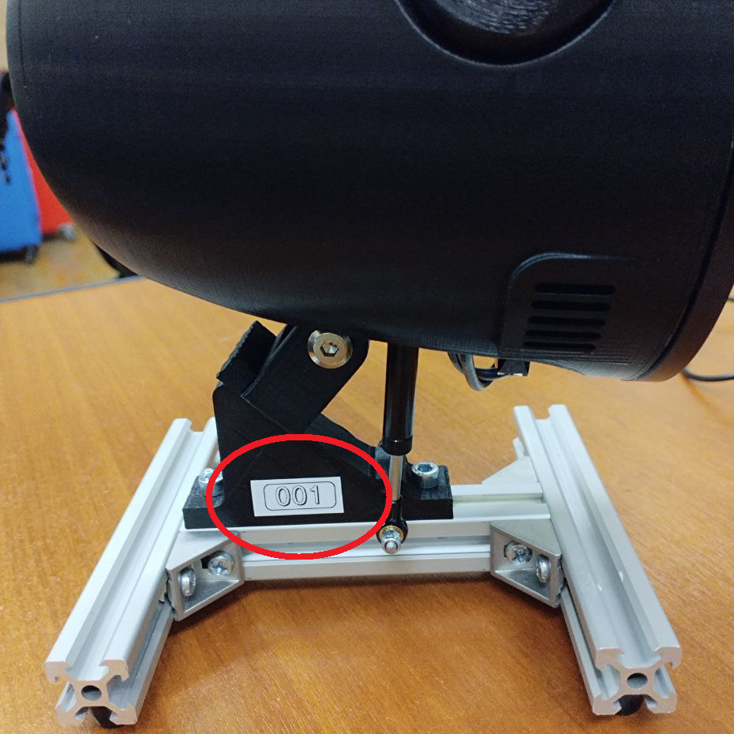

При включении устройства у вас есть два способа подключения к Робоголове: **Wi-Fi сеть** или **проводное соединение**.

---

## Настройка подключения к Wi-Fi

### Подключение к точке Wi-Fi по умолчанию

По умолчанию при старте Робоголова попытается подключиться к Wi-Fi точке доступа с параметрами:

```yaml
SSID: TurtleBro
password: turtlew001
```

или

```yaml
SSID: TurtleBro5G
password: turtlew001
```

:::note
Поэтому мы рекомендуем использовать именно такие настройки Wi-Fi роутера для работы с Робоголовой
:::

---

### Настройка подключения к новой Wi-Fi через SD карту {#new-wi-fi-sd}

На SD-карте, содержащей готовый образ Ubuntu 24.04.3 для запуска на роботе, есть два раздела разного размера. Обычно они называются `system-boot` и `writable`, но в некоторых случаях система может присвоить им другие имена при подключении к компьютеру:

- **system-boot** (FAT32)  
  - Небольшой раздел (несколько сотен МБ), необходимый для загрузки.  
  - Содержит:
    - Файлы загрузчика (`bootloader.bin`, `start*.elf` и др.)
    - Ядро Linux (`vmlinuz`)
    - Initramfs (`initrd.img`)
    - Конфигурационные файлы (`config.txt`, `cmdline.txt`, `network-config`)
  - Доступен для чтения на любом компьютере.

- **writable** (ext4)  
  - Основной раздел, занимающий большую часть SD-карты.
  - Содержит корневую файловую систему Ubuntu (`/`, `/home`, `/var` и т. д.).  
  - Здесь хранятся все пользовательские данные, установленные программы и настройки системы.  
  - При подключении к ПК может не отображаться автоматически (из-за ext4), но доступен в Linux или через специальные драйверы (например, ext4 для Windows).

:::note
**Важно:** При ручном изменении файлов в `system-boot` (например, `network-config`) соблюдайте осторожность — ошибки могут привести к невозможности загрузки системы.
:::

Для добавления новой Wi-Fi сети необходимо отредактировать файл `/etc/netplan/20-network-wifi.yaml`. Для этого необходимо:

1. Извлеките microSD-карту из Робоголовы и подключите её к компьютеру.
2. Перейдите в раздел **writable**, откройте терминал в папке и выполните:
   ```bash
   sudo nano /etc/netplan/20-network-wifi.yaml
   ```
3. Внутри файла `/etc/netplan/20-network-wifi.yaml` будет содержимое
   ```yaml
    network:
      version: 2
      wifis:
        renderer: networkd
        wlan0:
          dhcp4: true
          optional: true
          access-points:
            Aespen_2:
              password: 541a6d0759e7bebc027240dbfdb09b6a40a5781d4411dfcbef877695abd8ac7d
            Aespen_5:
              password: 9f6460e73f216afd3e1f1db7166dee7c155a327230871309e6519d688df8cfdf
            TurtleBro:
              password: cdf5ddb6e2702e358cd5f90f69f5f9555a0906a178923f040ccdda04c88a33df
            TurtleBro5G:
              password: 48b985767899d1a366f4bbf31309d123afa6a77d6eb1705b9b73aa2cc35c9d47
            Polygon5G:
              password: 4b5382a69ed19ae3c0dc05b212b787f3fd9dbb2d8ae68b7c41890d5719ba3716
   ```
4. В этом файле в поле wlan0 добавьте свою Wi-Fi сеть.

Пример, файла с новой Wi-Fi сетью:

```yaml
SSID: myWIFI
password: qwerty123
```

   ```yaml
    network:
      version: 2
      wifis:
        renderer: networkd
        wlan0:
          dhcp4: true
          optional: true
          access-points:
            Aespen_2:
              password: 541a6d0759e7bebc027240dbfdb09b6a40a5781d4411dfcbef877695abd8ac7d
            Aespen_5:
              password: 9f6460e73f216afd3e1f1db7166dee7c155a327230871309e6519d688df8cfdf
            TurtleBro:
              password: cdf5ddb6e2702e358cd5f90f69f5f9555a0906a178923f040ccdda04c88a33df
            TurtleBro5G:
              password: 48b985767899d1a366f4bbf31309d123afa6a77d6eb1705b9b73aa2cc35c9d47
            Polygon5G:
              password: 4b5382a69ed19ae3c0dc05b212b787f3fd9dbb2d8ae68b7c41890d5719ba3716
            myWifi:
              password: qwerty123
   ```
5. Сохраните файл (`Ctrl+S` -> `Ctrl+X`).
6. Извлеките SD-карту и вставьте обратно в Робоголову.

> Если после некорректных настроек устройство перестало подключаться к Wi-Fi, используйте **проводное соединение** для исправления.

---

## Проводное соединение

1. Подключите Ethernet-кабель к порту Raspberry Pi (под шейным модулем) и к вашему роутеру.
2. В веб-интерфейсе роутера в списке проводных клиентов найдите `roboheadXXX`, где `XXX` — серийный номер устройства.
3. При необходимости вернитесь к разделу **Настройка подключения к новой Wi-Fi** и отредактируйте конфигурацию.

