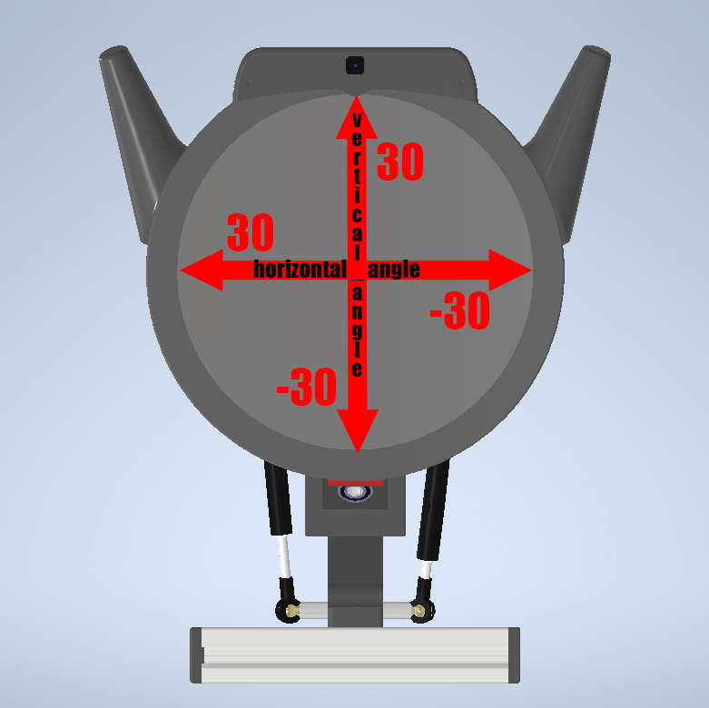

В этом разделе описаны схемы подключения, диапазоны движения и методы настройки сервоприводов Робоголовы Bbrain.

---

# 1. Схема подключения

Если вы разобрали устройство и требуется восстановить подключение сервоприводов, ориентируйтесь на следующую таблицу:

| Пин | Компонент                     | Параметр конфигурации                                       | Описание                                       |
| --- | ----------------------------- | ------------------------------------------     | ------------------------------------------     |
| 7  | **Левое ухо**                 | `servo_1_channel`          | SG90 — управляет поворотом левого уха          |
| 6  | **Правое ухо**                | `servo_2_channel`         | SG90 — управляет поворотом правого уха         |
| 5   | **Правый шейный сервопривод** | `servo_1_channel` | MG995 — двигает **правую** тягу (провод слева) |
| 4   | **Левый шейный сервопривод**  | `servo_2_channel` | MG995 — двигает **левую** тягу (провод справа) |

:::warning
Перед подключением убедитесь, что Робоголова отключена от питания, а также убедитесь в целостность проводов и разъёмов.
:::

---

# 2. Система координат

**Шейные сервоприводы (MG995):**

* **Yaw (горизонтальный поворот):** от -30° (влево) до +30° (вправо)
* **Pitch (вертикальный наклон):** от -30° (вниз) до +30° (вверх)



**Ушные сервоприводы (SG90):**

* **Угол поворота:** от -90° (полностью вниз) до +90° (полностью вверх)

---

:::warning
**Важно!** Перед редактированием файлов остановите Linux-сервис:
```bash
sudo systemctl stop robohead.service
```
:::


## 3. Методы настройки

### 3.1 Инициализационное положение

Задаётся в конфигурационных-файлах:

* Ушные сервоприводы: `~/robohead_ws/src/robohead2/robohead_controller/config/ears_driver.yaml`:

  ```yaml
  std_left_angle: 0
  std_right_angle: 0
  ```

* Шейные сервоприводы: `~/robohead_ws/src/robohead2/robohead_controller/config/neck_driver.yaml`:

  ```yaml
  std_vertical_angle: 0
  std_horizontal_angle: 0
  ```

После правки конфигов перезапустите сервис:

```bash
sudo systemctl restart robohead.service
```

## 3.2 Управление в текущей сессии

Используйте ROS-сервисы для динамической установки положений:

* **Установка углов шеи:**

  ```bash
  ros2 service call /robohead/neck_driver/neck_set_angle robohead_interfaces/srv/Move "angle_a: 15
  angle_b: -10
  duration: 1.0"
  ```
  **Параметры:**

  * `angle_a` – угол поворота по вертикали (тангаж), в градусах
  * `angle_b` – угол поворота по горизонтали (рысканье), в градусах
  * `duration` – время, за которое голова достигает позиции, в секундах


* **Установка углов ушей:**

  ```bash
  ros2 service call /robohead/ears_driver/ears_set_angle robohead_interfaces/srv/Move "angle_a: -45
  angle_b: 90
  duration: 1.0" 
  ```

  **Параметры:**

  * `angle_a` – угол поворота левого уха, в градусах
  * `angle_b` – угол поворота правого уха, в градусах
  * `duration` – время, за которое уши достигают позиции, в секундах


---

## 4. Важные ограничения

* **Шейные сервоприводы:**

  * Не выходите за диапазон -30° … +30° по каждой оси
  * Избегайте длительной работы в крайних положениях
  
* **Ушные сервоприводы:**

  * Не выходите за диапазон -90° … +90°
  * Не допускайте механических перегрузок (принудительное удержание вручную)

---

## 5. Рекомендации

1. Остановите основной сервис перед изменениями:

   ```bash
   sudo systemctl stop robohead.service
   ```
2. После настройки перезапустите сервис:

   ```bash
   sudo systemctl restart robohead.service
   ```


