# Обновление образа операционной системы

## Зачем нужно обновлять образ ОС?

Обновление (или перезапись) образа операционной системы устройства может потребоваться в следующих случаях:

* **Восстановление после сбоев**
Если устройство перестало загружаться, зависает, проявляет нестабильное поведение или возникает ошибка при запуске сервисов, перезапись образа позволяет вернуть устройство к рабочему состоянию.

* **Возврат к заводским настройкам**
После длительного использования, установки дополнительных пакетов, изменений в настройках или конфигурации ROS может понадобиться «чистый старт» — установка стандартного, протестированного образа с заводскими параметрами.

* **Обновление до новой версии программного обеспечения**
Разработчики могут выпускать обновлённые версии образа с:
    - новыми функциями;
    - улучшенной производительностью;
    - обновлёнными библиотеками и зависимостями;
    - исправлениями ошибок.

Обновление образа гарантирует, что пользователь работает с последней стабильной сборкой.

* **Подготовка к участию в соревнованиях или обучении**
Для работы по единому сценарию (например, на олимпиадах, соревнованиях или учебных курсах) часто требуется, чтобы у всех участников была **одинаковая программная среда**, получаемая через установку одного и того же образа.

* **Поддержка совместимости с новым *оборудованием**
В новых версиях образа могут быть добавлены драйверы, параметры или модули для поддержки обновлённого или дополнительного оборудования (датчиков, контроллеров, дисплеев и т.д.).

## Ход обновления образа операционной системы

### Шаг 1: Подготовка устройства

1. **Полностью выключите Робоголову** и убедитесь, что зарядное устройство отключено.
2. **Снимите верхнюю крышку головы**, открутив 4 винта по периметру.
3. **Извлеките microSD-карту** из Raspberry Pi.

### Шаг 2: Скачивание образа системы

Скачайте актуальный образ операционной системы roboheadOS по ссылке:

👉 [Скачать образ системы](https://disk.yandex.ru/d/NliXCVUiNLG3eg)

### Шаг 3: Запись образа на microSD-карту

Вы можете использовать один из следующих методов:

#### Метод 1: Использование balenaEtcher

1. Скачайте и установите [balenaEtcher](https://etcher.balena.io/) (доступно для Windows/MacOS/Linux).
2. Запустите приложение.

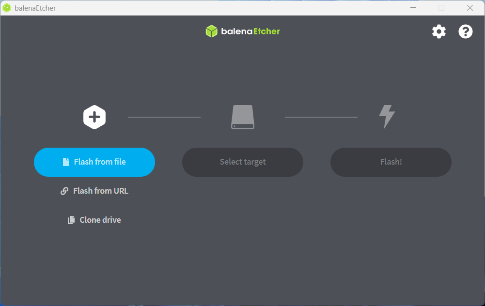

3. Выберите скачанный образ roboheadOS.

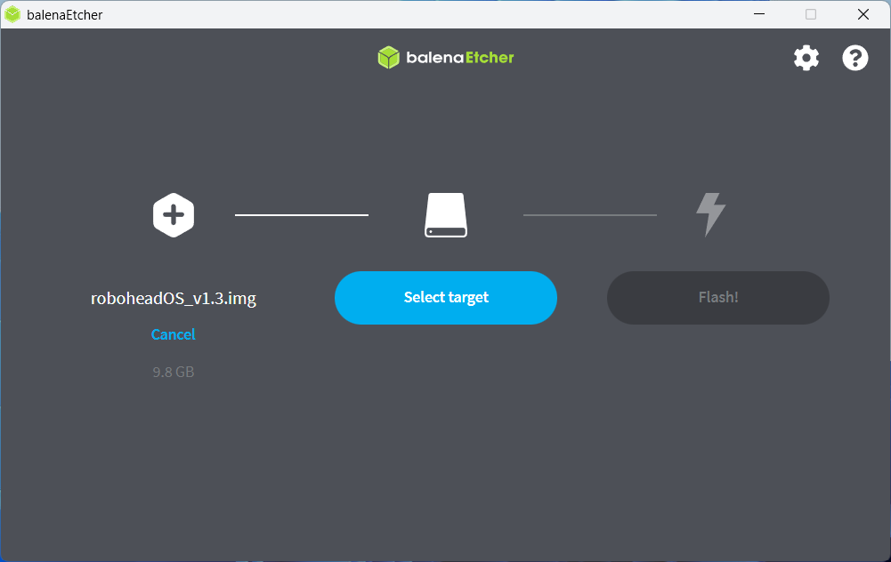

4. Вставьте microSD-карту в компьютер и носитель, на который будет загружен образ системы.

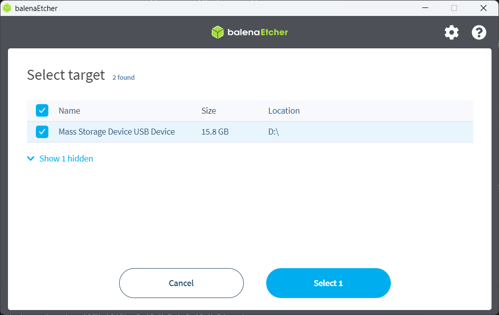

5. Нажмите кнопку **Flash**.

:::note
**Обратите внимание** сразу после старта записи образа могут "выскочить" предупреждения о том, что раздела не существует, и нужно форматировать microSD-карту. Делать этого совершенно не нужно! Закройте появившиеся окна и дождитесь окончания записи образа
:::

6. Дождитесь завершения записи образа на носитель.

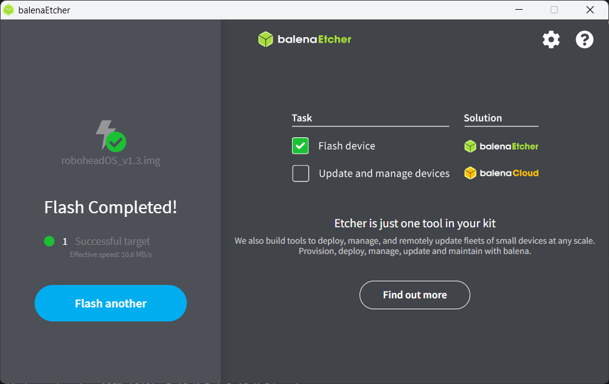

#### Метод 2: Использование Raspberry Pi Imager

1. Скачайте и установите [Raspberry Pi Imager](https://www.raspberrypi.com/software/) (доступно для Windows/MacOS/Linux).
2. Запустите Raspberry Pi Imager.

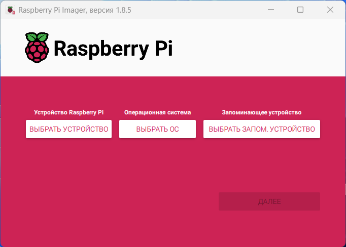

3. Выберите устройство **Raspberry Pi 4**.

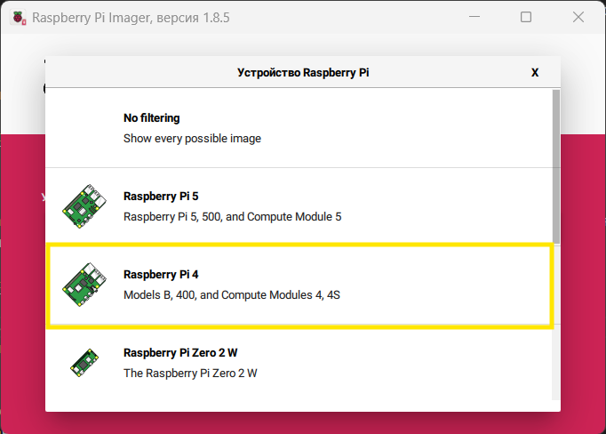

4. В окне выбора ОС прокрутите вниз и выберите **Use custom**.

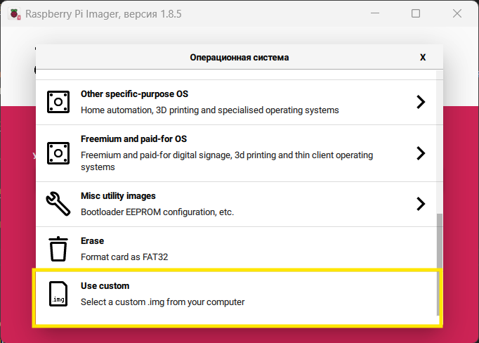

5. Выберите скачанный образ ОС.

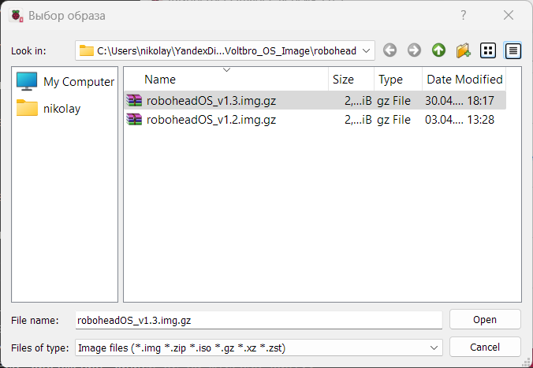

6. Подключите microSD-карту к компьютеру и выберите её как устройство для записи.

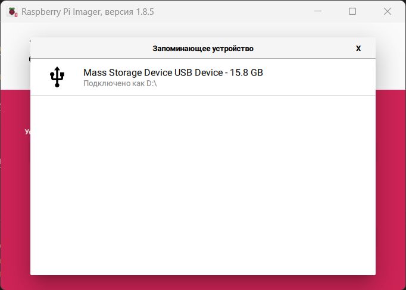

7. Нажмите **Далее** и выберите **Нет** при запросе дополнительных настроек.

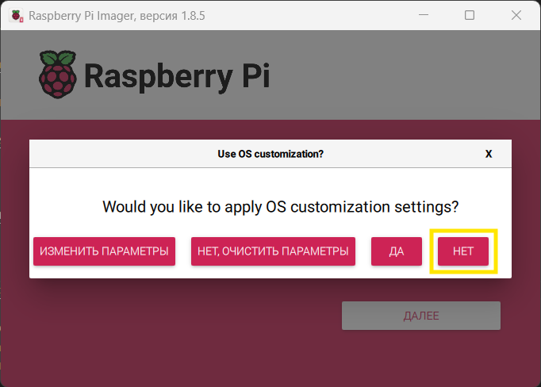

8. Согласитесь с форматированием запоминающего устройства.

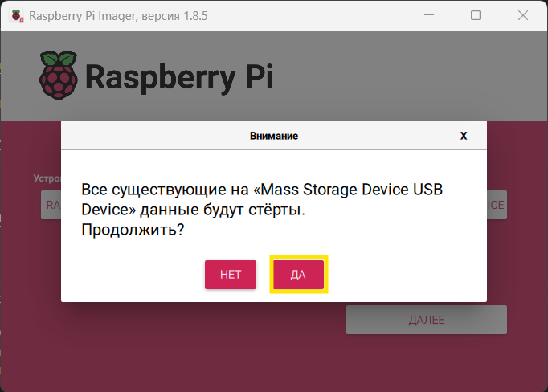

9. Дождитесь завершения записи ОС на microSD-карту.

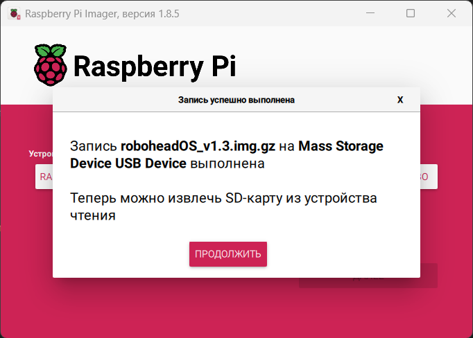

#### Метод 3: Использование утилиты `dd` (для Ubuntu)

1. Вставьте microSD-карту в компьютер.
2. Откройте терминал и выполните команду:

   ```bash
   lsblk
   ```

3. Определите устройство, соответствующее вашей microSD-карте (например, `/dev/sdb`)

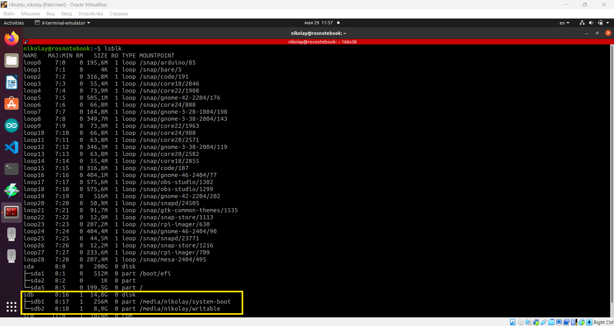

4. Перейдите в каталог со скачанным образом системы и выполните команду:

   ```bash
   sudo dd if=./roboheadOS_v1.3.img.gz of=/dev/sdb bs=5M status=progress
   ```

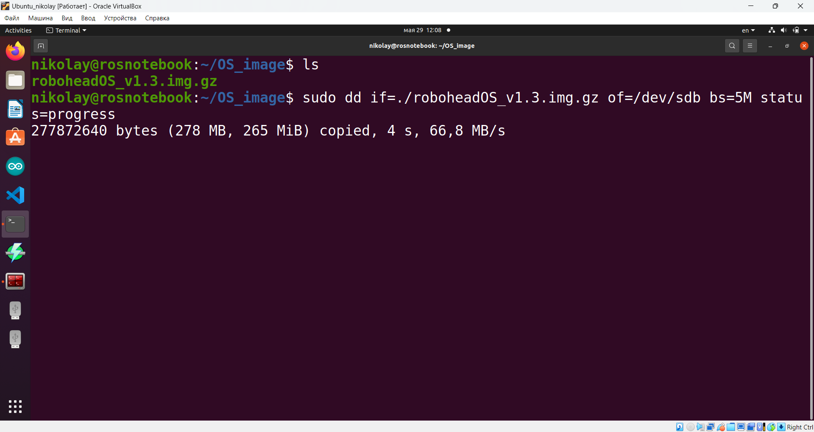

    :::warning
    **Важно:** Убедитесь, что указали правильное устройство (`/dev/sdb`), чтобы избежать потери данных на других носителях.
    :::

5. Дождитесь окончания записи образа на sd-карту (это может занять до 15-20 минут).

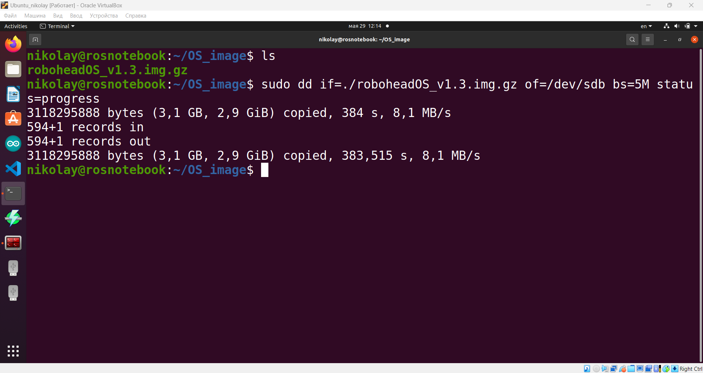

### Шаг 4: Установка microSD-карты и запуск устройства

1. Убедитесь, что Робоголова полностью выключена и зарядное устройство отключено.
2. Вставьте sd-карту в слот Raspberry Pi внутри головы.
3. Аккуратно верните верхнюю крышку на место и закрутите 4 крепежных винта.
4. Включите голову и дождитесь первичной инициализации системы.
5. Перезагрузите устройство еще раз.

### Шаг 5: Стандартные настройки устройства

После записи образа будут использоваться следующие настройки по умолчанию:

- **Сетевое имя устройства (hostname):** `robohead000`
- **Пароль пользователя:** `turtlew001`

Устройство будет автоматически подключаться к одной из следующих Wi-Fi сетей:

- **SSID:** `TurtleBro`  
  **Пароль:** `turtlew001`

- **SSID:** `TurtleBro5G`  
  **Пароль:** `turtlew001`

Подробнее об изменении стандартных настроек можно прочитать здесь: [→](30-device-setting/30-changing-device-settings.md)

### Шаг 6: Обновление программного обеспечения

После запуска и подключения по SSH рекомендуется выполнить следующие действия:

1. Перейдите в репозиторий `robohead`:

   ```bash
   cd ~/robohead_ws/src/robohead2
   ```

2. Синхронизируйте его, чтобы иметь актуальную версию:

   ```bash
   git pull
   ```
---

> ℹ️ **Примечание:** Убедитесь, что все действия выполняются с осторожностью. Неправильная запись образа или изменение конфигурационных файлов может привести к нестабильной работе устройства.


