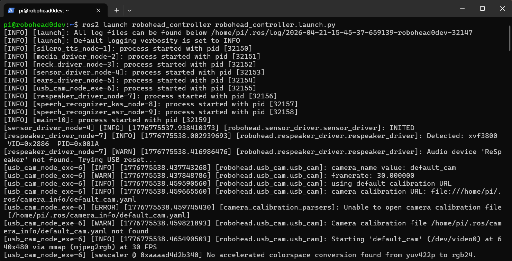

# Написание своего действия для robohead_controller

В этом разделе рассмотрим, как добавить собственное действие "**Улыбнись**", вызываемое голосовой командой, в систему управления Робоголовы (robohead_controller). Процесс состоит из трёх этапов:

1. **Добавление новой голосовой команды в словарь распознавания речи**  
2. **Создание скрипта действия**  
3. **Настройка конфигурации пакета robohead_controller**


Каждый шаг подробно описан ниже.

---

## 1. Добавление новой голосовой команды в словарь распознавания речи

1. Откройте конфиг-файл ASR-ноды:
   ```bash
   nano ~/robohead_ws/src/robohead2/robohead_controller/config/speech_recognizer_asr.yaml
   ```
2. Добавьте в `commands` команду **"Улыбнись"**. Получится примерно следующее:
   ```yaml
       commands:
         - 'покажи уши'
         - 'покажи левое ухо'
         - 'покажи правое ухо'
         - 'поздоровайся'
         - 'сделай фото'
         - 'повтори за мной'
         - 'ответь на вопрос'
         - 'следи за шариком'
         - 'покажи напряжение'
         - 'улыбнись'
   ```
---

## 2. Создание скрипта действия

Теперь, когда новая команда распознаётся речевым движком, необходимо написать сам код, который будет выполняться при активации «улыбнись». Для этого нам также понадобятся 2 файла:

[Картинка, выводимая на экран. smile.png](attachments/smile.png)

[Аудио-файл, воспроизводимый через динамики. smile.mp3](attachments/smile.mp3)

### 2.1 Структура папки скрипта и медиа-файлов

Перейдите в директорию, где хранятся скрипты действий:

```bash
cd ~/robohead_ws/src/robohead2/robohead_controller/robohead_controller/actions
```

Создайте папку `smile` для нового действия
```bash
mkdir smile
```

В папке `smile` создайте файл `action.py`. Переместите в эту же папку два медиа-файла: изображение улыбки (`smile.png`) и звуковой файл с «улыбкой» (`smile.mp3`). Если вы используете удалённое подключение (SFTP или VSCode Remote), просто перетащите эти файлы в папку `smile`.


### 2.2 Написание основного кода (action.py)

Откройте файл `action.py` и вставьте следующий код, который реализует действие «улыбки»:

```python
# smile
# действие, выполняющееся при команде "Улыбнись"

# Импорты нужны для автоподстановок кода при работе через VSCode
from __future__ import annotations
from typing import TYPE_CHECKING
import os

if TYPE_CHECKING:
    from robohead_controller.controller import RoboheadController
    import threading


def run(
    controller: RoboheadController, action_name: str, cancel_event: threading.Event
):
    """
    Args:
        controller: Ссылка на контроллер
        action_name: Команда, по которой было вызвано действие
        cancel_event: threading.Event для проверки отмены
    """
    action_dir = os.path.dirname(os.path.abspath(__file__)) # Путь к папке со скриптом, обычно это:
    # /home/pi/robohead_ws/build/robohead_controller/robohead_controller/actions/std_ears

    logger = controller.get_logger()        # logger - объект логирования, через него можно печатать в консоль
    logger.info(f"[{action_name}] start")   # выводим в терминал "[std_ears] start"

    # Выводим картинку smile.png без зацикливания воспроизведения (это же картинка) и блокирования вызова
    controller.media_driver.play_display(
        cancel_event=cancel_event,
        video_path=os.path.join(action_dir, "smile.png"),
        loop=False,
        block=False,
    )

    # Получаем угол, откуда пришёл голос и ограничиваем его в диапазоне от -30 до +30
    h_angle = max(-30, min(30, -controller.respeaker_driver.doa))  # type: ignore

    # Поворачиваем голову в сторону, откуда пришёл звук
    controller.neck_driver.set_angle(
        cancel_event=cancel_event,
        horizontal=h_angle, # Поворот в сторону звука
        vertical=30,    # Голова приподнята вверх
        duration=1.5,   # Длительность достижения положения 1.5 секунд
        block=False,    # Неблокирующий вызов
    )

    controller.ears_driver.set_angle(
        cancel_event=cancel_event,
        left=-90,       # Левое ухо назад на 90 градусов
        right=90,       # Правое ухо вперед на 90 градусов
        duration=0.5,   # Достижение положения на 0.5 секунды
        block=False,    # Неблокирующий вызов
    )

    # Проигрываем звук smile.mp3 без зацикливания воспроизведения и блокирования вызова
    controller.media_driver.play_audio(
        cancel_event=cancel_event,
        audio_path=os.path.join(action_dir, "smile.mp3"),   # Воспроизводим аудио-файл "smile.mp3"
        loop=False, # Воспроизведение без зацикливания
        block=True, # Блокирующий вызов
    ) 

    logger.info(f"[{action_name}] finish")  # выводим в терминал "[std_ears] finish"
```

**Что происходит в коде:**

1. **controller.media_driver.play_display(...):** выводит на экран робота изображение `smile.png`
2. **controller.neck_driver.set_angle(...):** поворачивает голову к говорящему, используя угол `controller.respeaker_driver.doa`, возвращаемый микрофоном ReSpeaker. Ограничение угла в диапазоне от −30° до +30° обеспечивает плавность и безопасность движения.  
3. **controller.ears_driver.set_angle(...):** разворачивает уши в стороны, устанавливая углы на −90° (левое ухо) и +90° (правое ухо), что усиливает впечатление «улыбающегося» робота.  
4. **controller.media_driver.play_audio(...):** приостанавливает дальнейшие действия до окончания воспроизведения аудиофайла `smile.mp3`, чтобы завершить «улыбку» звуковым сопровождением.

---

## 3. Настройка конфигурации пакета robohead_controller

Осталось связать голосовую команду с написанным скриптом. Для этого редактируем файл `robohead_controller/config/robohead_controller.yaml`.

### 3.1 Открытие конфигурационного файла

Файл находится по пути:

```
~robohead_ws/src/robohead2/robohead_controller/config/robohead_controller.yaml
```

Откройте его в любом удобном редакторе.

### 3.2 Добавление новой команды в словарь `robohead_controller_actions_match`

Найдите секцию, отвечающую за сопоставление распознанных команд с соответствующими скриптами:

```yaml
actions_match: >
{
  "std_startup" :       "std_startup/action.py",
  "std_wait":           "std_wait/action.py", 
  "std_low_bat":        "std_low_bat/action.py",
  "std_attention":       "std_attention/action.py",
  "поздоровайся":       "std_greeting/action.py",
  "покажи уши":         "std_ears/action.py",
  "следи за шариком" :  "std_ball_tracker/action.py",
  "сделай фото" :       "std_make_photo/action.py",
  "покажи левое ухо" :  "std_left_ear/action.py",
  "покажи правое ухо" : "std_right_ear/action.py",
  "повтори за мной" :   "std_echo/action.py",
  "ответь на вопрос" :  "std_llm/action.py",
  "покажи напряжение" : "std_show_voltage/action.py",
  "громче" :            "std_volume_up/action.py",
  "тише" :              "std_volume_down/action.py",
  # Добавляем связку для команды «улыбнись»
  "улыбнись" :          "smile/action.py"
}
```

> **Совет:** Следите за правильными кавычками и отсутствием лишних запятых, чтобы YAML-файл оставался рабочим.

## 4. Применение изменений
Для применения изменений в конфигурационных файлах (движка распознавания речи и `robohead_controller.yaml`) требуется перезапуск пакета `robohead_controller`. Сделать это можно тремя способами:
- Остановить Ubuntu-сервис и запустить пакет в ручном режиме для отладки (наиболее предпочтительный вариант, так как можно сразу увидеть появляющиеся ошибки)
- Перезапустить Ubuntu-сервис (удобен для проверки работы того, как будет работать Робоголова после перезагрузки питания)
- Физически перезагрузить Робоголову через кнопку питания (наименее удобный вариант, посколько придется ждать загрузки всей системы заново)

Далее проделайте **один** из шагов 4.1 или 4.2, или перезагрузите голову.
### 4.1 Запуск в режиме отладки

Остановите Ubuntu-сервис (в этот момент пакет `robohead_controller` и все зависимости автоматически остановятся)
```bash
# Останавливаем сервис robohead
sudo systemctl stop robohead.service
```
Запустите `robohead_controller` и все зависимости в ручном режиме:

```bash
ros2 launch robohead_controller robohead_controller.launch.py
```
На экране терминала должен появиться примерно следующий вывод:



### 4.2 Перезапуск Ubuntu-сервиса

```bash
# Останавливаем сервис robohead, если не был остановлен
sudo systemctl stop robohead.service

# Запускаем сервис заново
sudo systemctl start robohead.service
```

Для удобства вместо этих двух комманд можно использовать:
```bash
sudo systemctl restart robohead.service
```
Если всё прошло успешно, новый скрипт будет загружен, и Робоголова сможет реагировать на команду «улыбнись».

## 5. Итоговое поведение

После выполнения всех вышеописанных шагов, при произнесении команды **«Слушай, Робот! Улыбнись!»** произойдёт следующее:

1. Голова робота определит направление голоса и плавно повернётся к говорящему (±30° по горизонтали, +30° по вертикали).  
2. Уши робота развернутся в стороны (левое ухо на −90°, правое на +90°), создавая эффект «улыбки».  
3. На экран выведется изображение `smile.png`, усиливая визуальное восприятие «улыбки».  
4. Проиграется аудиофайл `smile.mp3`, добавляя звук к «улыбающемуся» роботу.  

Таким образом, вы получите полностью работающее и наглядное голосовое действие, которое легко редактировать и расширять в дальнейшем.


## 6. Отладка команд
В этом шаге описано как запускать стандартные действия, не произнося каждый раз голосом нужную команду.

Отлаживать команды можно как при автоматически запущенном `robohead_controller` (через Ubuntu-сервис), так и когда он запущен в ручном режиме (этот вариант предпочтительнее для отладки, так как видны все возникающие ошибки)

Откройте новое окно терминала, подключитесь к Робоголове.
Далее нужно опубликовать Робоголове ключевую фразу:
```bash
ros2 topic pub /robohead/speech_recognizer/kws/wake_phrases std_msgs/msg/String "data: 'слушай робот'" --once
```

И, пока не прошел таймаут, успеть опубликовать команду, которую нужно запустить:
```bash
ros2 topic pub /robohead/speech_recognizer/asr/commands std_msgs/msg/String "data: 'улыбнись'" --once
```

После публикации команды Робоголова должна выполнить стандартное действие "**Покажи уши**".

Аналагично можно запускать и другие стандартные действия.
> В `.../kws/wake_phrases` можно публиковать что угодно - фиксируется факт нахождения ключевой фразы
> В `.../asr/command` нужно публиковать команды, которые описаны в `actions_match` в `robohead_controller/config/robohead_controller.yaml`.